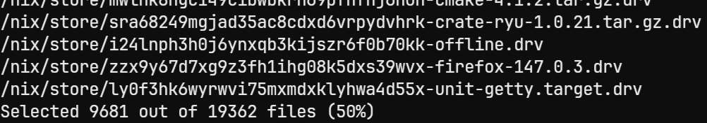

# lots

Randomly selects 50% of your local files and returns their absolute paths.

Written in Rust 🦀

  

## For what?

Lots returns a list of file paths that you can easily pipe into your favorite commands, such as:

+ `xargs rm -f`

## Awesome features

+ Specify the percentage of files to select, or an exact number
+ Include directories in addition to regular files
+ Customize the maximum recursion depth, or disable it entirely
